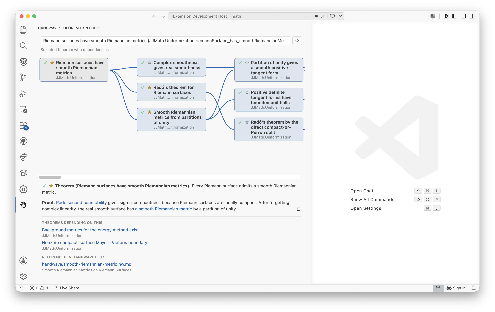
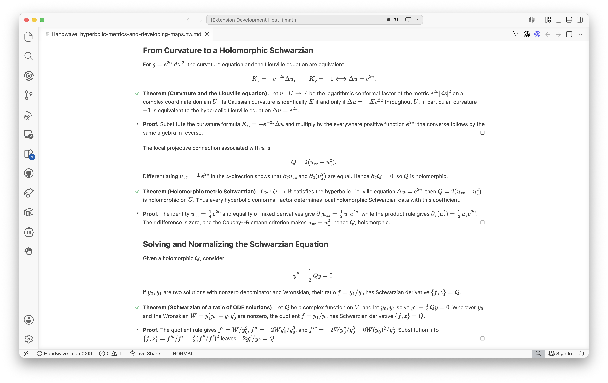
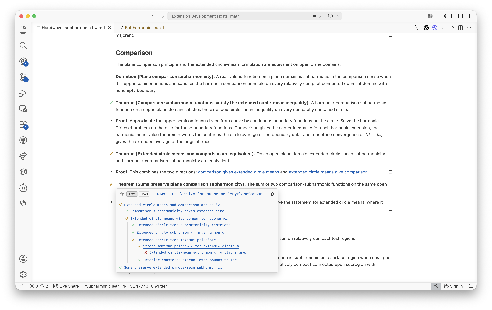

# Handwave

Handwave is a tool for turning annotated Lean projects into readable mathematical overviews. It indexes ordinary `.lean` files, reads structured `%%handwave` documentation blocks placed next to declarations, and renders those declarations together with `.hw.md` / `.hw` article files in an
interactive preview.

The same project model and browser interface are available through a Visual Studio Code extension, a read-only static-site generator, and a local wiki-like webserver.

The goal is to make formalized mathematics easier to browse as mathematics: the Lean declaration remains the source of truth, while nearby prose explains the statement, proof idea, and role of the result. Handwave then connects those annotated declarations into article-style narratives, dependency views, backlinks, and Lean status badges.

_This version of Handwave is a **vibe-coded prototype** that could later on be replaced by a more robust version._

## Screenshots



*The theorem explorer shows a dependency tree and details about a chosen theorem.*



*A summary article rendered by Handwave. Handwave has checked that Lean seems happy, so all theorems have a green checkmark.*



*This time there are some yellow checkmarks. Hovering over one of the theorems opens a dependency tree showing the path to a sorry (red cross).*

## What Handwave Provides

- An index of Lean declarations, Handwave articles, links, includes, and
  backlinks.
- Rendered previews for annotated Lean files and Handwave article files.
- Human-readable theorem, lemma, definition, and proof views generated from Lean declarations plus `%%handwave` prose.
- Explorer views for theorem dependencies, definitions used by statements and proofs, declarations that use a selected definition, and article backlinks.
- Article links such as `[the theorem](lean:My.result)` and transclusions such as `@include{lean:My.result}`.
- Lean status badges showing whether a theorem is checked, pending, stale, blocked, locally unchecked, or checked only modulo incomplete dependencies.
- A dependency popover for theorem badges.
- Diagnostics for malformed Handwave doc blocks and unresolved article links.
- Code lenses on cited Lean declarations showing Handwave citation counts.

Handwave is deliberately lightweight. Lean files remain Lean files, article files remain Markdown-like text files.

## Annotating Lean Files

Put a structured `%%handwave` block in a Lean doc comment immediately before a declaration:

```lean
/--
%%handwave
name:
  Addition associativity
statement:
  Addition of natural numbers is associative: $(a + b) + c = a + (b + c)$.
proof:
  This follows from the standard associativity theorem for natural addition.
tags:
  milestone
-/
theorem my_add_assoc (a b c : Nat) :
    (a + b) + c = a + (b + c) := by
  exact Nat.add_assoc a b c
```

Common fields:

- `name`: optional display name used in rendered labels.
- `statement`: mathematical prose for the declaration statement.
- `proof`: mathematical prose for the proof sketch.
- `tags`: comma- or whitespace-separated metadata tags.

Handwave also stores the Lean statement and Lean proof, so previews can toggle between prose and source views where appropriate.

The special `milestone` tag marks an important theorem in the preview. Hover a theorem label to open its source popup; a filled or empty star appears before the text/Lean view toggle buttons. Click the star to toggle the `milestone` tag in the source block.

The special `shadow` tag excludes a declaration from Handwave's index. This is useful for challenge or comparison files that intentionally repeat a declaration name without replacing the project declaration in previews, relationship graphs, or status checks.

## Writing Handwave Articles

Handwave article files use the extensions `.hw.md` or `.hw`. They support headings, Markdown-style links, and include commands:

```markdown
# Associativity

The central observation is that
[parentheses do not matter for repeated addition](lean:my_add_assoc).

@include{lean:my_add_assoc}
```

Including a declaration renders its full theorem or definition view. Theorem and lemma includes contain a proof section when proof prose is available. Use proof selectors only when you want to include just the proof sketch or source.

Useful target forms:

- `lean:My.result`: link to or include a Lean declaration.
- `lean:My.result.statement`: include the prose statement.
- `lean:My.result.proof`: include only the prose proof sketch.
- `lean:My.result.lean.statement`: include the Lean statement source.
- `lean:My.result.lean.proof`: include only the Lean proof source.
- `article:path/to/article#section`: link to an article section.
- `local:#section`: link to a section in the current article.
- `term:...`: mark ordinary mathematical terminology without requiring a Handwave target.

## Lean Status Badges

For theorem-like declarations, Handwave combines direct source checks with optional Lean dependency probes.

Badge meanings:

- Green check: Lean dependency checks found no transitive dependency on `sorryAx`.
- Yellow check: the declaration checks, but a transitive dependency still uses `sorryAx`.
- Red cross: the declaration is locally unchecked, for example because it has a direct `sorry` / `admit`. The experimental Lean-server backend also reports overlapping Lean errors this way.
- `...`: status is pending.
- `?`: Handwave attempted a dependency check but could not determine the result.
- `!`: the dependency check is blocked, for example because a file cannot be probed as a Lean module under the workspace root.
- Parenthesized badges: the displayed status is stale and predates the current Lean source or build state.

## Modes of Operation

Requirements:

- Node.js and npm.
- VS Code 1.90 or newer, for the extension.
- Lean and Lake, if the extension should build artifacts and perform dependency status checks. The static generator and webserver can use existing Lean artifacts but do not run Lean themselves.

Install the JavaScript dependencies once from the Handwave source directory:

```sh
npm install
```

### Visual Studio Code Extension

The extension provides editor-integrated previews, diagnostics, code lenses, source navigation, editable milestone tags, and a theorem-and-definition explorer. To run it from source, first compile it:

```sh
npm run compile
```

Open this folder in VS Code and launch an Extension Development Host. In the development host, open a Lean workspace containing `.lean`, `.hw.md`, or `.hw` files. Run `Handwave: Open Preview`, or click the Handwave editor-title icon for the active file.

To install the extension rather than running a development host, package it with `vsce`:

```sh
npx @vscode/vsce package
```

Then install the generated `.vsix` either through VS Code's `Extensions: Install from VSIX...` command or with:

```sh
code --install-extension handwave-0.0.1.vsix
```

After installation, reload VS Code and open a Lean project.

### Static Site Generator

The static generator writes the browser application, all theorem and definition previews, and all Handwave articles to one HTML file:

```sh
npm run export-site -- \
  --root /path/to/lean/workspace \
  --output /path/to/site/index.html
```

If `--root` is omitted, it defaults to the current directory. If `--output` is omitted, the exporter writes `handwave-site/index.html` below the selected root. The result uses repository-relative paths and needs no VS Code process, Handwave server, or runtime API calls. MathJax itself is loaded from jsDelivr.

The generated site is read-only. Its Overview lists the article tree and milestone theorems. Unified search covers articles, modules, theorems, and definitions; the explorer shows theorem dependencies and the theorems that use a selected definition. The preview sidebars connect theorems, definitions, and article backlinks. Article and declaration links, includes, local anchors, MathJax rendering, light/dark themes, reloadable hash URLs, browser history, and the foldable article table of contents all work within the generated file.

At export time Handwave reads available `.ilean` metadata and valid entries in `.lake/handwave/artifact-index-v1.json`. An available artifact is used even when its source file is newer, in which case the displayed Lean status is marked stale. If artifact information is unavailable, Handwave infers a source-snapshot graph and propagates direct `sorry` and `admit` uses through indexed dependencies. A source-inferred green badge is not a substitute for rebuilding Lean artifacts.

### Live Repository Webserver

The local webserver runs the same browser application against the actual Lean repository and adds in-browser editing:

```sh
npm run serve -- \
  --root /path/to/lean/workspace \
  --port 8080
```

The root defaults to the current directory. The server binds to `127.0.0.1:8080` by default; `--host` and `--port` select another listening address and port.

The webserver edits `.lean`, `.hw`, and `.hw.md` files directly. Article sections and headings can be edited in place, as can the `name`, `statement`, and `proof` metadata for theorems and definitions. Milestone tags can also be toggled in the browser. Saves carry content revisions and refuse to overwrite a file that changed after its editor was opened.

External source edits are picked up by the repository watcher and pushed to connected browsers. The watcher also debounces changes to `.ilean`, `.olean`, and `.trace` files below `.lake/build/`, plus `.lake/handwave/artifact-index-v1.json`, and refreshes Lean badges and artifact-derived theorem/definition relationships without restarting the server. Like the static generator, the webserver passively reads available artifacts and does not invoke Lean or Lake.

## Accessing Features in VS Code

Command palette commands:

- `Handwave: Open Preview`: open a rendered preview for the active `.lean`, `.hw.md`, or `.hw` file, or pick one from the workspace.
- `Handwave: Rebuild Index`: rescan Lean and Handwave article files.
- `Handwave: Refresh Lean Status`: mark known Lean dependency results stale and schedule fresh checks for open previews.
- `Handwave: Show Backlinks`: show articles and includes that cite a target.

Editor UI:

- When viewing `.lean`, `.hw.md`, or `.hw` files, use the Handwave editor-title button to open the preview for the current file.
- In Handwave preview tabs, use the back and forward buttons to navigate preview history.
- Click declaration labels, dependency tree entries, and article links to navigate within the preview.
- Use the source links in declaration popovers to jump back to the Lean source.
- Use the Handwave Activity Bar icon to open the theorem explorer. It defaults to milestone-tagged theorems, searches modules, theorems, and definitions, filters theorems by green, yellow, red, or unknown status, and shows a selected theorem or definition below the dependency graph. Selecting a definition shows the theorems that reference it.

Lean editor features:

- Cited Lean declarations receive a code lens showing their Handwave citation count.
- Hovering declaration names shows the Lean statement and any Handwave prose attached to the declaration.

Article editor features:

- Handwave links are clickable and open preview targets.
- Hovering links shows the resolved target preview.
- Unresolved links and malformed include targets are reported as diagnostics when diagnostics are enabled.

## Configuration

Settings are under the `handwave` namespace:

- `handwave.articleGlobs`: article files to index. Defaults to `**/*.hw.md` and `**/*.hw`.
- `handwave.leanGlobs`: Lean files to index. Defaults to `**/*.lean`.
- `handwave.excludeGlob`: files excluded from indexing. Defaults to `**/{node_modules,out,.git,.jj,.lake}/**`.
- `handwave.enableDiagnostics`: enable diagnostics for malformed Handwave syntax and unresolved targets.
- `handwave.enableLeanDependencyChecks`: enable artifact extraction and the source-probe fallback for theorem dependency status. Checks run in preview priority order and batch compatible declarations. When disabled, Handwave performs source-only checks and does not launch Lean in the background.
- `handwave.leanDependencyCheckBackend`: choose `subprocess` or `leanServer` for dependency checks. The default is `subprocess`, which runs optimized `lake env lean` probes without opening hidden Lean documents. `leanServer` remains available as an explicit experimental backend.
- `handwave.leanDependencyCheckDelayMs`: debounce before running dependency checks.
- `handwave.autoBuildLeanArtifacts`: automatically run a targeted `lake build` when a demanded module needs fresh `.olean` and `.ilean` artifacts. Enabled by default and ignored in untrusted workspaces.
- `handwave.leanArtifactBuildTimeoutMs`: timeout for an automatic Lake build.
- `handwave.leanDependencyCheckTimeoutMs`: timeout for each Lean probe.
- `handwave.leanDependencyCheckBatchSize`: maximum compatible declarations extracted in one Lean process. The default is 1024 to keep generated Lean probes within the elaborator's recursion limit.

## Development

```sh
npm install
npm run compile
npm test
```

The tests compile the TypeScript sources and run the parser, renderer, static-export, and live-server test suites with Node's built-in test runner.

### Source boundaries

Handwave keeps its shared indexing and rendering code separate from host integration:

- `src/handwave/` contains the host-neutral project model, parsers, index, artifact readers, preview renderer, and theorem-explorer payload builder.
- `src/web/` contains the browser application rendered into a webview or standalone page. It does not load the VS Code API at runtime.
- `src/vscode/` contains the adapters that connect browser messages and shared Handwave data to VS Code.
- `src/static/` contains the workspace crawler, passive artifact reader, single-file exporter, and static-export CLI.
- `src/server/` contains the loopback HTTP adapter, live-file workspace, and in-place browser editor integration.
- `src/extension.ts` is the VS Code composition root.

The extension, static exporter, and live webserver therefore reuse the sam parsers, index, renderer, and browser application while keeping their host-specific behavior separate.
